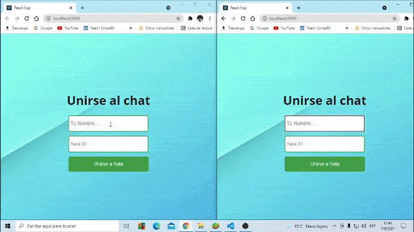

# Chat-React-Js-Node-y-Socket-io-
Primer app de práctica con Socket.io. :confounded:

En el package.json de la 📁del servidor instalé Express,Nodemon,Cors y la libreria Socket.io
En el archivo index.js está el punto de entrada al servidor.

En la parte del cliente instalé la libreria socket.io-client que establece la conexion con la variable <strong> io</strong> en el servidor

Usé useState para representar el nombre de usuario y el ID de la sala y ...comentarios en el codigo.

